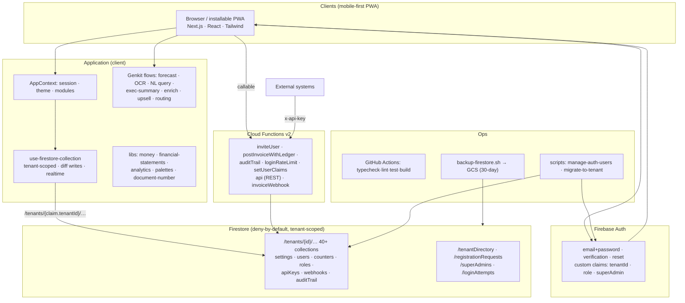

# CZiumERP — Software Documentation

Version 5 · Multi-tenant ERP platform

---

## 1. What CZiumERP is

CZiumERP is a modular, multi-tenant Enterprise Resource Planning system. One deployment
serves many client organizations ("tenants") in complete isolation, with a platform
operator ("super admin") overseeing all of them — the Odoo/Zoho SaaS model. Each tenant's
dedicated administrator enables modules, defines roles, invites users, and brands the
system, all without touching another tenant's data.

**Stack:** Next.js 15 (App Router) · React 18 · TypeScript · Firebase (Auth + Firestore) ·
Cloud Functions v2 · Genkit + Google AI · shadcn/Radix UI · Tailwind CSS.

---

## 2. Architecture



**Trust model:** the client is untrusted. Firestore rules verify the caller's `tenantId`
claim equals the data path — cross-tenant access is structurally impossible. Cloud
Functions enforce what rules cannot (balanced ledgers, stock invariants, tamper-proof
audit). Claims are the only identity source; profile documents are display data.

**Data isolation:** every business record lives at `/tenants/{tenantId}/{collection}/{doc}`.
There is no shared collection a query could accidentally leak across.

---

## 3. Identity tiers

| Tier | Claim | Scope | Powers |
|---|---|---|---|
| Super Admin | `superAdmin: true` | All tenants | Create/suspend tenants, industry templates, module allowance, registration approvals |
| Tenant Admin | `tenantId` + `role: admin` | One tenant | Modules, users, custom roles, branding, all settings |
| Manager / Cashier / Inventory | `tenantId` + role | One tenant | Day-to-day work gated by role + custom permissions |

---

## 4. Functional modules

**Sales & POS** — invoices (4 print/receipt templates), POS scanner, quotations
(draft→convert-to-invoice), returns, payments, loyalty tiers, recurring invoices.

**CRM** — customers (loyalty, credit limits, 360 data), leads, campaigns, upselling,
AI lead enrichment.

**Finance & Accounting** — general ledger (double-entry), **financial statements
(P&L / Balance Sheet / Cash Flow with AI executive summary)**, **bank reconciliation
(CSV match)**, tax rates, budgets, fixed assets, AR/AP.

**Supply Chain** — products (bin location, reserved stock, serial numbers), vendors
(scorecards), purchase orders, RFQ, shipping with AI route optimization, **cycle counting**.

**Manufacturing** — bills of materials, production orders, quality checks.

**HR** — employees, attendance, leave, performance reviews, recruitment, payroll,
**timesheets**, **expense claims**, **departments/org chart**.

**Projects & Service** — projects, tasks (Gantt), support tickets with AI analysis.

**Analytics & AI** — **advanced analytics** (CLV, product profitability, churn risk,
supplier performance), **AI assistant** (natural-language queries), **invoice OCR**,
sales/demand forecasting, **AI executive summaries**.

**Platform** — super-admin console, tenant onboarding with industry templates, custom
role builder, CSV bulk import, module toggles, per-tenant branding, automation/workflow
engine, presence, activity feed, notifications.

**Developer** — **REST API** (`/v1/{invoices,products,customers}`, API-key auth),
**outbound webhooks** (invoice.created).

---

## 5. Theming & appearance

- **Light/Dark mode** — proper dedicated dark palette. Dark surfaces are *brand-tinted*
  (derived from the tenant's primary hue) rather than flat grey, so the app stays colorful
  in both modes. The earlier bug where a tenant's light background bled into dark mode is
  fixed: only brand colors (primary/accent) cross into dark; the dark background is
  computed from the brand hue.
- **12 curated palettes** (indigo, emerald, crimson, ocean, amber, violet, slate, rose,
  teal, sunset, grape, forest) — all validated for WCAG-AA white-text contrast by an
  automated test. Admins can also set custom colors, with a live contrast warning.
- **Colorful semantic tokens** — status pills (`.pill-success/warning/danger/info`), a
  6-color vibrant chart palette, and brand-gradient stat cards.
- **Document templates** — Classic, Modern (color banner), Minimal, and POS Thermal
  Receipt, each with customizable logo, footer, and accent.

---

## 6. Security summary

Deny-by-default Firestore rules · Firebase Auth with email verification · tenant isolation
by path · custom-claim RBAC + custom roles · server-side rate limiting · tamper-proof audit
trail · HSTS/CSP/COOP/CORP headers · secret-guarded CI · logo upload validation · API-key
gated public API. See DEPLOYMENT-COMPLETE.md for the full deploy + hardening steps.

---

## 7. Deployment

See **DEPLOYMENT-COMPLETE.md** — 11 ordered steps from a blank Google account to a live
system, plus a post-deploy verification checklist and troubleshooting.

Quick path:
```bash
firebase deploy --only firestore:rules,firestore:indexes
cd functions && npm i && npm run build && firebase deploy --only functions && cd ..
node scripts/manage-auth-users.mjs create ops@you.com 'Pass!' admin --tenant bootstrap
node scripts/manage-auth-users.mjs superadmin ops@you.com
firebase deploy --only apphosting   # or: npm run build && npm start
```

---

## 8. REST API reference

```
GET /v1/invoices?tenant=<id>&limit=100      Header: x-api-key: <key>
GET /v1/products?tenant=<id>
GET /v1/customers?tenant=<id>
```
Generate a key: create `/tenants/{id}/apiKeys/{randomKey}` = `{ active: true }` (tenant admin).
Webhooks: register `/tenants/{id}/webhooks/{id}` = `{ event: 'invoice.created', url: '...' }`.

---

## 9. Repository map

```
src/app/            Route pages (App Router) — one folder per module
src/components/      Shared UI (shadcn), Nav, error boundaries, EmptyState, OfflineBanner
src/context/         AppContext (session/data/theme), PresenceContext
src/hooks/           use-firestore-collection, use-debounce, use-require-role
src/lib/             money, financial-statements, analytics, palettes, document-number, posting
src/ai/flows/        Genkit AI flows
functions/           Cloud Functions (server-side integrity + REST + webhooks)
scripts/             manage-auth-users, migrate-to-tenant, backup-firestore
docs/                ARCHITECTURE.md
firestore.rules      Security rules (deny-by-default, tenant-scoped)
firestore.indexes.json  Composite indexes
```

---

## 10. Testing

`npm run test` runs 27 unit tests (RBAC, money arithmetic, color contrast, financial
statements, analytics). CI additionally runs typecheck, lint, secret/rules guards, and a
production build on every push. Roadmap: Playwright E2E for the top workflows, coverage to
80% on money paths.
