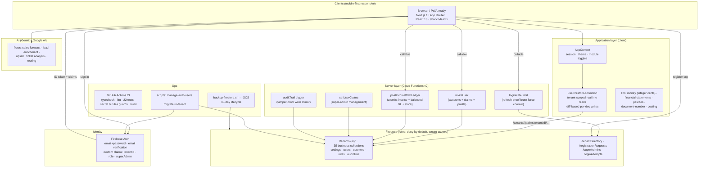

# CZiumERP — System Architecture

## Data flow (happy path)
1. User signs in → Firebase Auth returns an ID token carrying `tenantId` + `role` claims.
2. Every read/write goes to `/tenants/{tenantId}/…`; security rules verify the claim
   matches the path segment — cross-tenant access is structurally impossible.
3. Writes are optimistic in the UI, diffed against the previous snapshot, and
   committed as per-document batched operations (never a full-collection rewrite).
4. Cloud Functions handle what clients must not: account provisioning, claims,
   transactional posting with balanced-ledger + stock invariants, tamper-proof audit.
5. Super admins bypass tenant scoping via the `superAdmin` claim and operate the
   platform from `/super-admin`.

## Trust boundaries
- **Client** is untrusted: rules + functions enforce everything that matters.
- **Claims** are the only identity source; profile docs are display data.
- **auditTrail** and **activityLogs** are write-locked against clients.
